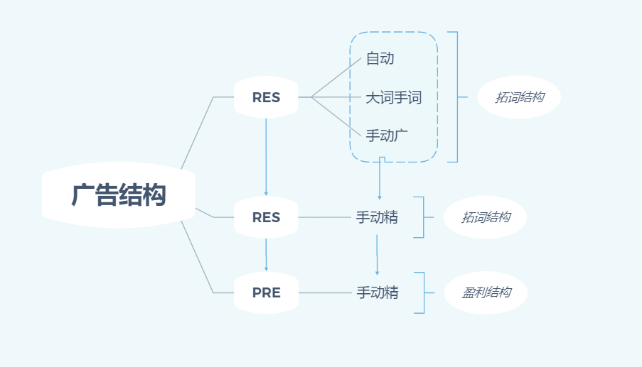

# Sponsored Advertising
+ TODO: 广告类型  <12-06-21, yuzhe> +
+ TODO: 广告结构  <12-06-21, yuzhe> +
+ TODO: 命名规则  <12-06-21, yuzhe> +
+ TODO: 广告工具  <12-06-21, yuzhe> +

## 广告类型
### 所有广告类型：

### 广告结构
一般人做的广告结构:

这里有个明显不足的地方，拓词组只有一个自动，广告类型太过单一，拓展的词非常有限，时间线拉的很长。
我们下面看下改进后的广告结构：

1. Res组拓展出来词
2. Res拓展次放入手动广告中，这里有盈利和不盈利的词,这里不好优化。
3. 步骤`2` 而中的词会越积累越多，基本优化不动，在将好的词`复制` 到PRE盈利组中去，同时对原广告组中的词降价,这里提到的`复制` 复制环境，**匹配方式，竞价，预算** 移植过去。
5. 放大组，(数据源可以取前两个步骤的，`步骤三` 精准匹配，拓展不出什么搜索词)ROAS高的前几个，与出单量多的前几个词，多广告，取`ROAS高与出单量多的前几个广告` 放入放大组，bid = suggestbid + 0.5
### Sponsored Advertising依图例：

