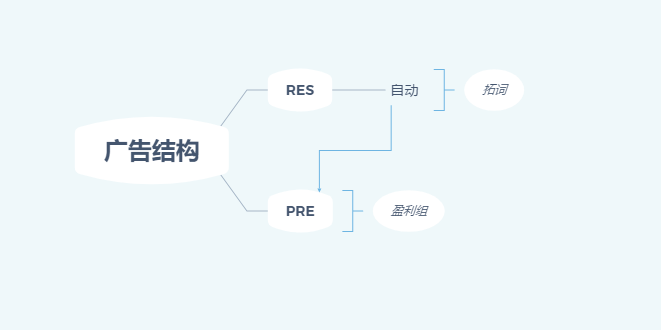
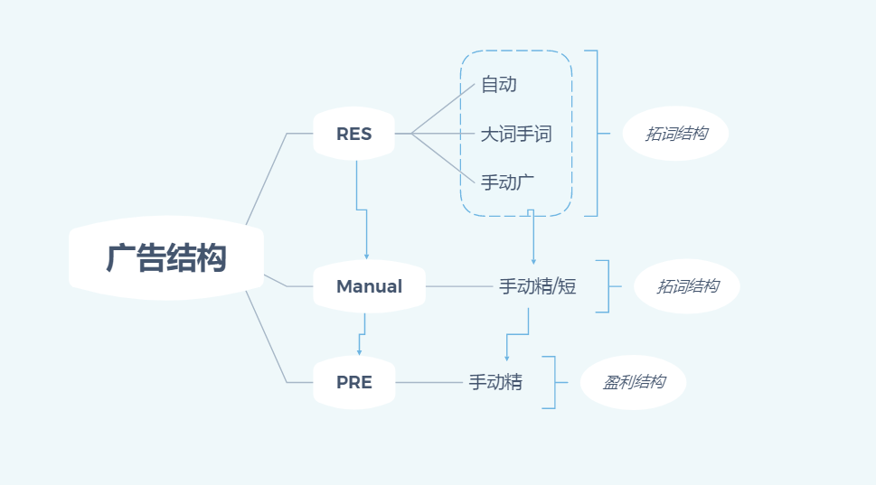
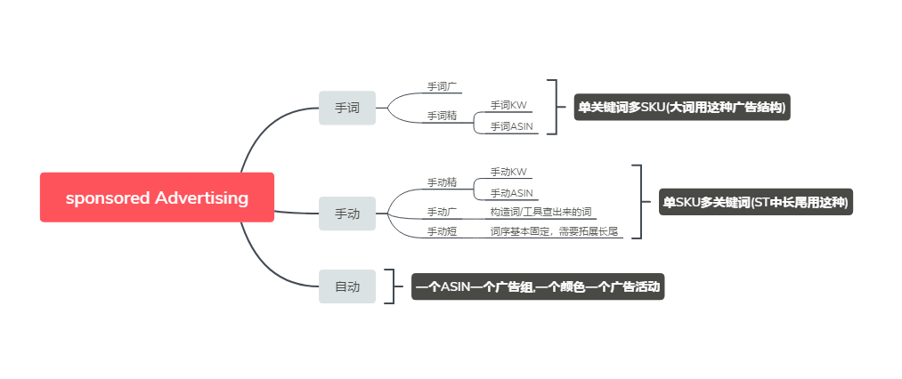

# Sponsored Advertising
+ TODO: 广告类型  <12-06-21, yuzhe> +
+ TODO: 广告结构  <12-06-21, yuzhe> +
+ TODO: 命名规则  <12-06-21, yuzhe> +
+ TODO: 广告工具  <12-06-21, yuzhe> +

## 广告类型
### 所有广告类型：

### 广告结构
一般人做的广告结构:

1. 这里有个明显不足的地方，拓词组只有一个自动，广告类型太过单一，拓展的词非常有限，时间线拉的很长。
2. 自动跑出来的词直接放入PRE是不合理的，中间需要再建一个Manual广告活动，将RES的词放入这个类型的广告活动中，从Manual活动中筛选出好的词，再放入到PRE广告活动中。

	我们下面看下改进后的广告结构：
	
	1. Res组拓展出来词，广告类型包括如下结构：

	| 广告类型 | 解释                         |
	|----------|------------------------------|
	| `自动`   | 自动广告(`单SKU` 每个广告组) |
	| `手词`   | `单个词` 多SKU的广告活动     |
	| `手广`   | `手动广泛`(`单SKU` 多次)     |

	2. Res拓展次放入手动广告中，这里有盈利和不盈利的词,这里不好优化。

	| 广告类型 | 解释               |
	|----------|--------------------|
	| `手动`   | 手动Keyword        |
	| `手动A`  | 手动ASIN           |
	| `高转`   | 词/ASIN 转化率高   |
	| `潜力`   | 词/ASIN 转化率略高 |
	| `中等`   | 词/ASIN 转化率中等 |

	Tips:

	怎么去界定词的转化率的高低，判断一个词的优劣？

	看搜索词报告 我是这样将词分开来的，很多词一个订单买多件的，我把这个`搜索词` 定义为`高转` 词。
	即：转化率高于100% 的词。

	一个词客户点击了购买的欲望普遍高，我定义这个搜索词为`潜力` 词。即转化率介于50 ～100% 的搜索词。

	我将搜索词转化率 大于0 ～小于50% 的词，叫做`中等` 词。(这里有人会疑惑大于0，如果这个搜索词acos很高，有出单也加进去吗，我这里给出的答案是加进去, 下面我会给出我自己的理解)

	一个是你从`RES` 这个广告类型跑出来的搜索词，在`RES` 广告活动中表现出来的转化率，即你看到报表的转化率，并不是真实的反映是这个词在该产品中的表现。这句话怎么理解呢？`RES` 跑出来的词都通过关键词的某种匹配方式跑出来的搜索词或是自动广告跑出来的搜索词，看数据，这个搜索词的数据量会很小，本身可能就是几次点击或10几次点击。

	第二个是，随着你的listing表现越来越好，review积累的越来越多，这些词的转化率也会随之变化。所以要以发展的眼光来看待你的关键词。

	第三个是，我们做广告`加关键词` 是有梯度的，比如：我们先加`高转词` `潜力词` ,所以这种词可以随时间梯度优先级，在后面加这些词。

3. 步骤`2` 而中的词会越积累越多，基本优化不动，在将好的词`复制` 到PRE盈利组中去，同时对原广告组中的词降价,这里提到的`复制` 复制环境，**匹配方式，竞价，预算** 移植过去。

	-理论依据：步骤`2` 中的词积累越来越多，*表现好* ,*表现坏* 的词都加在里面，里面*表现坏* 的词不一定对这个asin`表现坏` ,也有可能是好词/大词，吃掉大部分预算，导致给这些表现坏的词预算不足，可能一个月才点击`十几次` 可能没出单，并不代表这个词就不行。

	所以最好的方法就是把`表现好` 的词`复制` (复制环境，bid,匹配方式，做广告SKU,预算)出来,同时对原广告活动中的`本词` 降价(我推荐降价20%)，这样这写词吃的预算少了，极大可能--之前表现差的词，预算分配的多了，表现更好了。

4. 放大组，(数据源可以取前两个步骤的，`步骤三` 精准匹配，拓展不出什么搜索词)ROAS高的前几个，与出单量多的前几个词，多广告，取`ROAS高与出单量多的前几个广告` 放入放大组，bid = suggestbid + 0.5

	-原理同`3` .`3` 中针对的是广告活动中的词，这里加的词都是该广告活动中的`搜索词` 。`ROAS` 前几为了保预算，`订单量` 前几为了保销量，两个中和一下，就能保整个广告活动表现良好。类似于一个listing中要设置价格梯度，`爆款ASIN` 需要低价去拉销量，拉高整个listing的`BSR` .`非爆款ASIN`需要保利润，设置相对较高的价格，在拉高销量的同时不至于亏损太多。 言之：`为个性买单`  。
### Sponsored Advertising依图例：

